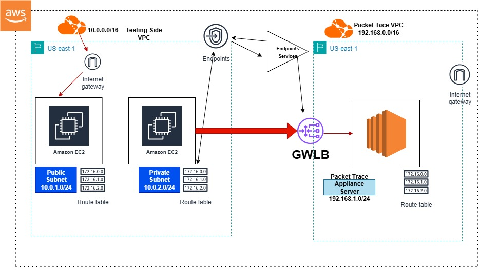

# aws-glb-packet-trace-project
Centralized security architecture using AWS GWLB to inspect traffic and log unauthorized access attempts to private AWS resources.
# AWS Gateway Load Balancer - Centralized Traffic Inspection Project

 Project Overview
This project demonstrates a secure network architecture using AWS Gateway Load Balancer (GWLB) to inspect traffic flowing between different VPCs. It showcases how to implement a centralized inspection model using GENEVE encapsulation, effectively separating the "Testing/Consumer" environment from the "Appliance/Security" environment.

 Architecture

*(Note: Ensure your diagram file is named `image.png` and is in the root of the repo)*

Infrastructure Components
The setup consists of the following AWS resources configured across two VPCs:

 1. Networking (VPCs & Subnets)
    2 VPCs:
       Testing VPC : Acts as the consumer side (Source of traffic).
       Packet Trace VPC : Acts as the provider side (Hosts the inspection appliance).
    3 Subnets:
       Testing VPC:1 Public Subnet (for Bastion/Access), 1 Private Subnet (Source workload).
       Packet Trace VPC:1 Public Subnet (for Appliance Server).
    2 Internet Gateways (IGW): Attached to both VPCs to allow connectivity.

 2. Compute (EC2 Instances)
    3 EC2 Instances:
       Public Instance (Testing): Acts as a Bastion host or public entry point.
       Private Instance (Testing): The source of the traffic that needs inspection.
       Appliance Server: Simulates a firewall/IDS appliance (receives GENEVE traffic).

 3. Gateway Load Balancer Configuration
    Target Group: Configured with GENEVE Protocol on Port 6081.
    Gateway Load Balancer (GWLB):Deployed in the Packet Trace VPC to distribute traffic to the appliance.
    Endpoint Service: Created off the GWLB to allow other VPCs to connect via PrivateLink.

 4. Routing & Connectivity
    GWLB Endpoint (GWLBE): Deployed in the Testing VPC to serve as the entry point to the load balancer.
    Route Tables: 3 Route Tables:Configured for respective subnets.
    Critical Routing Logic: The Private Subnet Route Table is modified to direct all outbound traffic (0.0.0.0/0) to the GWLB Endpoint, forcing traffic through the inspection path before reaching the internet.

 How it Works
1.  Traffic originates from the EC2 instance in the Testing Private Subnet.
2.  The Route Table directs this traffic to the GWLB Endpoint.
3.  The Endpoint encapsulates the traffic using GENEVE and forwards it to the GWLB in the Packet Trace VPC.
4.  GWLB forwards the traffic to the Appliance Server on UDP port 6081.
5.  The appliance inspects the traffic, decapsulates it, and allows/denies based on security rules.

---
Status:Architecture Design & Manual Implementation Complete.
